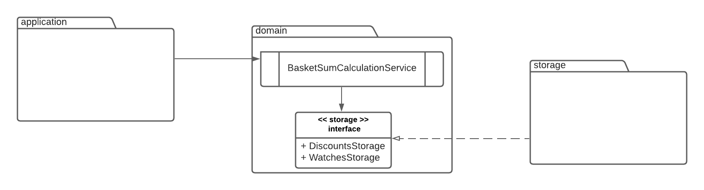

# Watches catalog
## Business value
Here we got the catalog of watches with simple discount rules.
The application allows to calculate the total sum of the basket
that contains different combinations of watches.
The catalog is the following:

| Watch ID  | Watch Name | Unit Price | Discount |
| ------------- | ------------- | ------------- |------------- |
| 001  | Rolex  | 100 | 3 for 200 |
| 002  | Michael Kors  | 80 | 2 for 120 |
| 003  | Swatch  | 50 |  |
| 004  | Casio  | 30 |  |


## How to test & run the application
Run tests and start the application:
> ./run.sh 

Calculate the sum of the watches basket:
```
curl -X POST \
http://localhost:8080/checkout \
-H 'Content-Type: application/json' \
-d '[
"001",
"002",
"003"
]'
 ```
The expected result is the following (code `200`):
```
{
    "price": 230
}
```
Also code `404` is possible for unknown watches models.
Code `400` for incorrect request body. 
And `500` for any unexpected server error
## Architecture

The main idea here is to help the domain package to 
be the most independent part of the application.
Here we see that storage implements the interface placed in domain package (IoC in action),
thus the business logic doesn't depend on the infrastructure, on the contrary
the infrastructure depends on business logic and in case of changing the storage type to NoSql 
or any other, business logic won't be affected.
## Technologies
* Java
* Spring Boot
* H2
* Lombok
* Maven
## What might be improved
* current solution uses the in-memory DB, suitable only for the current case, not for production and not even for dev environment

* H2 is also used in tests, the proper way is to use test containers database identical to the production one
* application is populated with data on the startup, the proper way is to create administration endpoint and make 
  the database persistent
* adequate errors handling must be implemented
* adequate logging needs to be added
* current way to run the application is not the proper one, has to be packaged & dockerized during pipeline
* the idea of new discounts types implemented, might be over engineered or not needed
